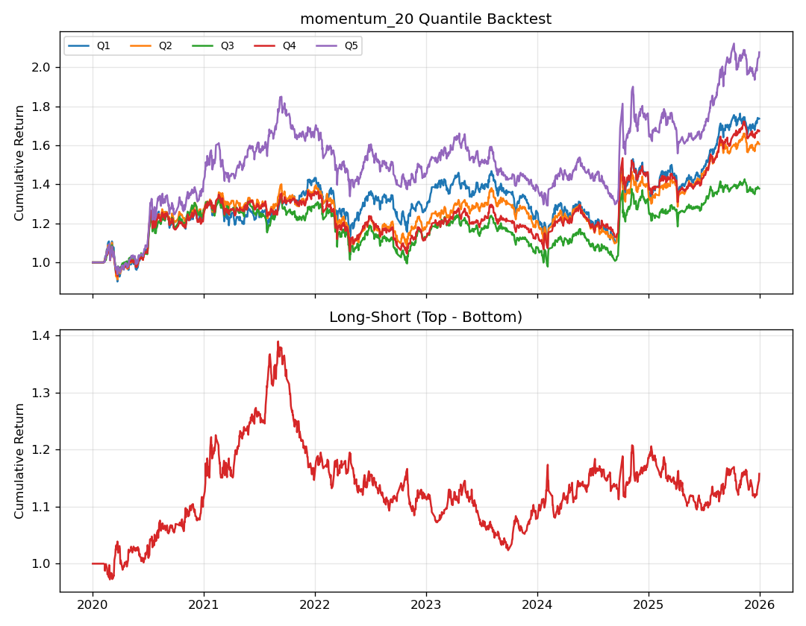
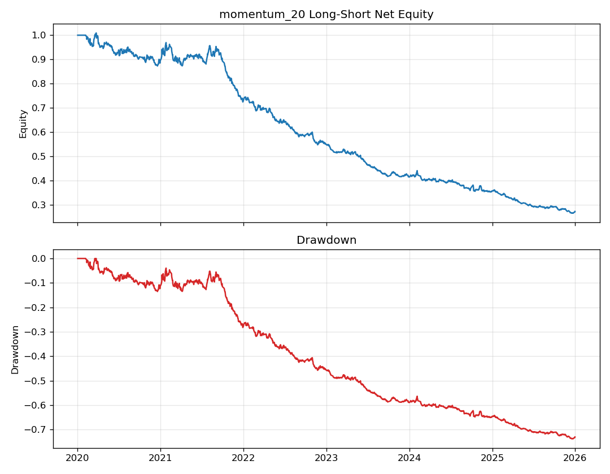

# 单因子研究报告

- 组合因子：momentum_20
- 年化收益：-20.16%
- 年化波动：10.50%
- 夏普比率：-2.09
- 最大回撤：-73.73%

## 因子检验汇总

| 因子          |   IC均值 |   IC标准差 |    ICIR |   RankIC均值 |   t统计量 |    p值 |   IC为正占比 | 显著(5%)   |
|:--------------|---------:|-----------:|--------:|-------------:|----------:|-------:|-------------:|:-----------|
| momentum_20   |  -0.0001 |     0.1117 | -0.0005 |      -0.0108 |   -0.0195 | 0.9845 |       0.5014 | False      |
| momentum_60   |   0.0009 |     0.1207 |  0.0076 |      -0.0059 |    0.2832 | 0.7771 |       0.5122 | False      |
| momentum_120  |   0.0017 |     0.1214 |  0.0139 |      -0.0007 |    0.5062 | 0.6128 |       0.5195 | False      |
| reversal_5    |   0.0024 |     0.1013 |  0.024  |       0.016  |    0.9144 | 0.3606 |       0.5059 | False      |
| volatility_20 |   0.0012 |     0.1082 |  0.0114 |      -0.0214 |    0.4325 | 0.6655 |       0.5    | False      |
| turnover_20   |  -0.0032 |     0.0956 | -0.034  |      -0.0186 |   -1.2871 | 0.1983 |       0.4836 | False      |

## 分层各档年化收益

|    | 年化收益   |
|---:|:-----------|
|  1 | 10.03%     |
|  2 | 8.56%      |
|  3 | 5.71%      |
|  4 | 9.33%      |
|  5 | 13.50%     |

- 单调性 Spearman 相关：0.300

## 图表

> 免责声明：本项目仅用于量化学习，结果不代表任何投资建议；回测含未来函数、幸存者偏差、停牌处理不完整等已知局限。
